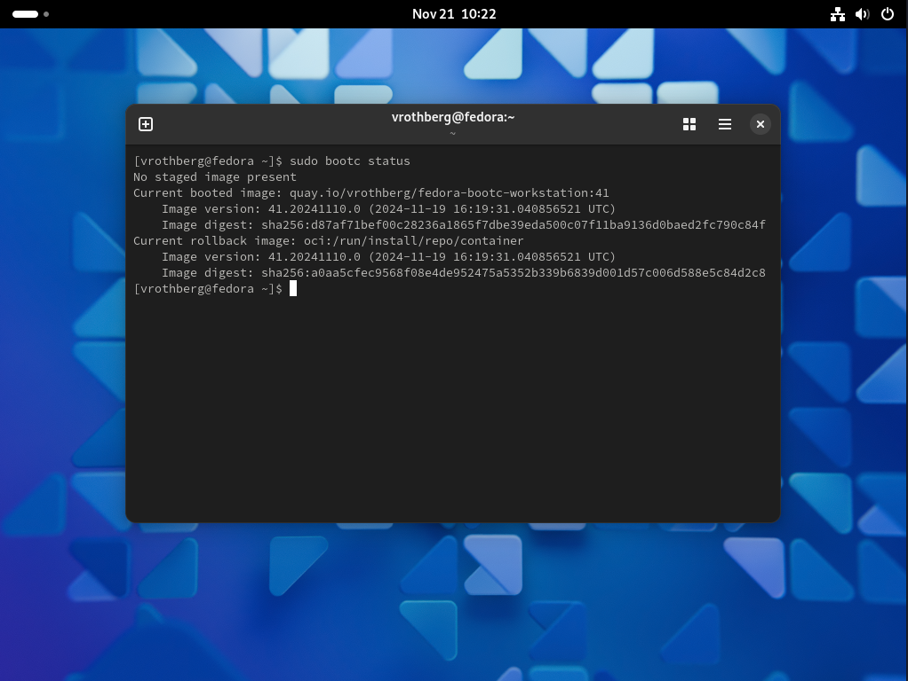

Gerard Braad's Fedora Workstation
=================================

_using [bootc](https://docs.fedoraproject.org/en-US/bootc/)_

> [!NOTE]
> This image is based on my [gbraad-devenv/fedora](https://github.com/gbraad-devenv/fedora) image, and is therefore personalized;
> it uses  `gbraad` as user with my [dotfiles](https://github.com/gbraad/dotfiles) and tailored to use services exposed by my [homelab](https://github.com/gbraad-homelab) setup.
> For a more generic image, have a look at the [fedora-bootc-workstation](https://github.com/vrothberg/fedora-bootc-workstation) project.

